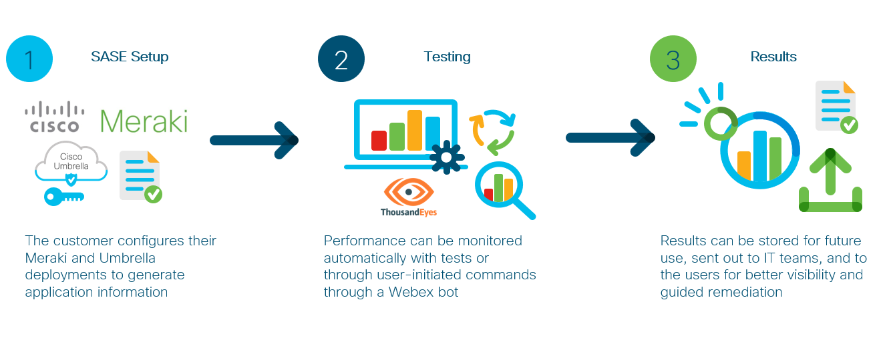
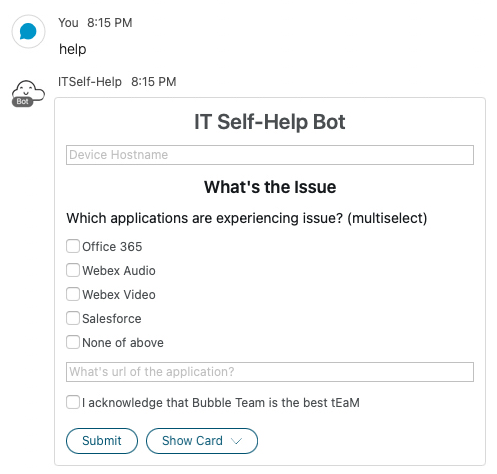
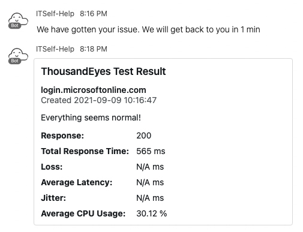
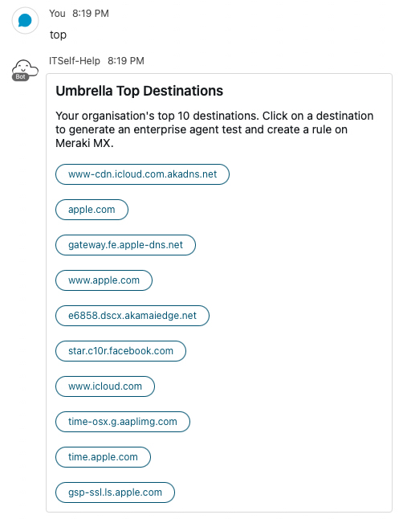
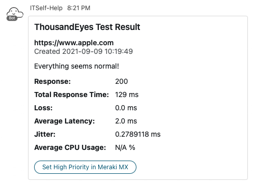
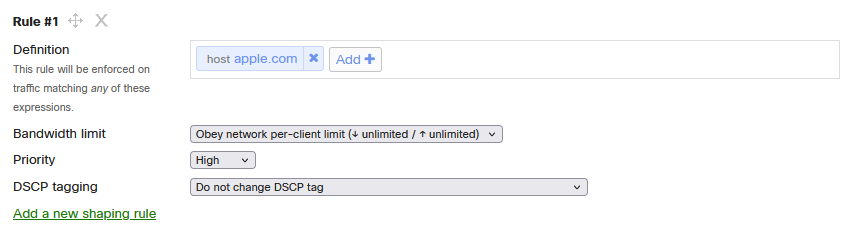

# True Hybrid SASE

This is the source code for True Hybrid SASE, a Webex bot that integrates functionality from Umbrella, Meraki, and ThousandEyes
for hybrid employees and IT teams to use. It allows users to create instant tests on ThousandEyes Endpoint Agents and Enterprise Agents,
gather information about top destinations from Umbrella, and prioritise traffic from these destinations on
Meraki MX.

### High Level Design


## Contacts

* Josh Ingeniero (jingenie@cisco.com)
* Yi Ren (yire@cisco.com)
* Hemang Hitesh Shah (hhiteshs@cisco.com)


## Solution Components
* Python
* Flask
* Webex Teams SDK
* ThousandEyes API's
* Umbrella Reporting API's
* Meraki Dashboard API's

## Installation:

#### Clone the repo
```console
git clone https://www.github.com/joshingeniero/true-hybrid-sase-asic
```
#### Set up a Python venv
First make sure that you have Python 3 installed on your machine. We will then be using venv to create
an isolated environment with only the necessary packages.

##### Install virtualenv via pip
```
$ pip install virtualenv
```

##### Create a new venv
```
Change to your project folder
$ cd GVE_Devnet_Meraki_Syslog_Parser

Create the venv
$ virtualenv venv

Activate your venv
$ source venv/bin/activate
```

#### Install dependencies
```
$ pip install -r requirements.txt
```


## Setup:

### Webex Bot

#### Bot Creation
You must create a Webex Bot using the Developer pages [here](https://developer.webex.com/docs/bots).
You would then obtain the Bot ID, Token, and Email which will be used for this application.

Fill in the details of your Webex Bot in the [DETAILS.py](DETAILS.py) file.
```python
# Webex Bot
BOT_ID = 'BOT_ID'
BOT_TOKEN = 'BOT_TOKEN'
BOT_EMAIL = 'yoursasebot@webex.bot'
```

#### Connectivity
You need to expose the server bot publicly so Webex can send webhooks. You can do this with
ngrok, Heroku, Amazon Lightsail, or any other method.

By default, the flask server runs on port 5060. You may change this in [app.py](app.py):
```python
if __name__ == '__main__':
    app.run(host='0.0.0.0', port='5060', debug=True)
```

#### Webhook Setup
You need to set up two Webhooks:
* All Endpoint - For receiving any other events
* Card Endpoint - For receiving card-related information

Create the webhooks [here](https://developer.webex.com/docs/api/v1/webhooks/create-a-webhook) with the following details:
* All Endpoint
```
name: SASEbot All
targetUrl: https://myexample.site.com/
resource: attachmentActions
event: created
```
* Card Endpoint
```
name: SASEbot Card
targetUrl: https://myexample.site.com/card
resource: messages
event: all
```
These correspond to the _/_ and _/card_ endpoints of the flask server respectively.
You may refer to the Webex Developer guide on Webhooks [here](https://developer.webex.com/docs/api/guides/webhooks)
for more information.

#### Meraki details:
You can deploy this prototype in a lab environment or on your own Meraki dashboard online
[here](https://account.meraki.com/secure/login/dashboard_login).

To generate an API KEY, refer to the documentation [here](https://documentation.meraki.com/zGeneral_Administration/Other_Topics/The_Cisco_Meraki_Dashboard_API#Enable_API_access).
You will use this for getting an ORGANIZATION ID, and using this application.

You must select an organization to manage and use its ORGANIZATION ID. You may do so by using Meraki's Postman collection
[here](https://documenter.getpostman.com/view/7928889/SVmsVg6K#18e62fd9-402a-4768-ab5e-f11a44651cfe) and GET the list of organizations,
or use Meraki's API Docs to generate a request [here](https://developer.cisco.com/meraki/api-v1/#!get-organizations).
Then you should select the appropriate network and use its NETWORK ID [here](https://developer.cisco.com/meraki/api-v1/#!get-organization-networks)

Fill in the details of your Meraki deployment in the [DETAILS.py](DETAILS.py) file
```python
# Meraki
MERAKI_API_KEY = 'API_KEY'
MERAKI_NET_ID = 'NET_ID'
MERAKI_ORG_ID = 12345
```

#### ThousandEyes details:
You would need to have access to a ThousandEyes deployment with at least one Endpoint Agent and one Enterprise Agent
to act as an employee and branch testing sites.

To generate a Bearer Token, refer to the documentation [here](https://developer.thousandeyes.com/v6/).
You will use this for creating instant tests and getting data for this application.

You must select an Enterprise Agent and use its Agent ID. You may do so by using ThousandEyes API's to query
for the appropriate Enterprise Agent ID [here](https://developer.thousandeyes.com/v6/agents/#/agents).

Fill in the details of your ThousandEyes deployment in the [DETAILS.py](DETAILS.py) file.
```python
# ThousandEyes
Authorization = 'Bearer BEARER_TOKEN_HERE'
ENT_AGENT = 123456
```

#### Umbrella details:
You would need to have access to an Umbrella deployment with data on Top Destinations.

To generate a Reporting Key and Secret, refer to the documentation [here](https://developer.cisco.com/docs/cloud-security/#!reporting-v2-getting-started).
You will use this for getting data on Top Destinations for this application.

You must obtain your Organization ID. You may do so by copying the numbers found in your Umbrella dashboard's
URL like this example:
```
https://dashboard.umbrella.com/o/*******/#/overview
```
Where the ******* stands for the Organization ID.

Fill in the details of your Umbrella deployment in the [DETAILS.py](DETAILS.py) file.
```python
# Umbrella
UMBRELLA_REPORTING_KEY = 'REPORTING_KEY'
UMBRELLA_REPORTING_SECRET = 'REPORTING_SECRET'
UMBRELLA_ORG_ID = 'ORG_ID'
```


## Usage:

### Python
Run the flask server to serve bots
```
$ cd sasebot
$ python app.py
```

### Webex Bot
Initiate a chat with your bot using your bot's email address. You may type in a query cotaining one
of the following hot words to initiate a command:
* _help_ - Employee-facing card to create an endpoint instant test
* _top_ - IT Team-facing card to show Umbrella top destinations, create an enterprise agent instant test, and change priority on Meraki MX

### Employee Card


### Employee Test Result


### Top Destinations


### Enterprise Agent Test Result


### Meraki MX Traffic Shaping Priority



### Logging
Functions are being logged in the [app.log](/splash-syslog/app.log) file. You may check this file
for any errors or problems.

## License
Provided under Cisco Sample Code License, for details see [LICENSE](./LICENSE.md)

## Code of Conduct
Our code of conduct is available [here](./CODE_OF_CONDUCT.md)

## Contributing
See our contributing guidelines [here](./CONTRIBUTING.md)


#### DISCLAIMER:
<b>Please note:</b> This script is meant for demo purposes only. All tools or scripts in this repo are released for use "AS IS" without any warranties of any kind, including, but not limited to their installation, use, or performance. Any use of these scripts and tools is at your own risk. There is no guarantee that they have been through thorough testing in a comparable environment and we are not responsible for any damage or data loss incurred with their use.
You are responsible for reviewing and testing any scripts you run thoroughly before use in any non-testing environment.